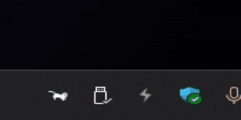

# GoCat

## Tags

- `Go` `Windows` `Mac`

## Demo

## Features

- **Real-time CPU Usage Display**: Shows CPU usage percentage in the system tray.

## Requirements

To run GoCat, you need the following installed on your system:

- **Go**: Version 1.15 or newer. You can download it from [Go's official site](https://golang.org/dl/).

## Usage

1. After starting GoCat, you'll see its icon in the system tray.
2. Click on the icon to access the menu:
    - Select different animal icons (cats, horses, parrots) to change the icon theme.
    - Exit the GoCat application.

## Development

- Contributions are welcome! Feel free to submit bug reports, feature requests, or pull requests.
